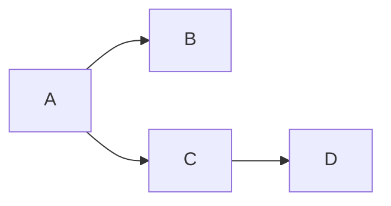
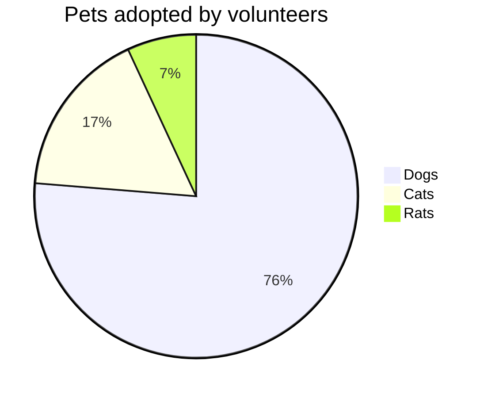
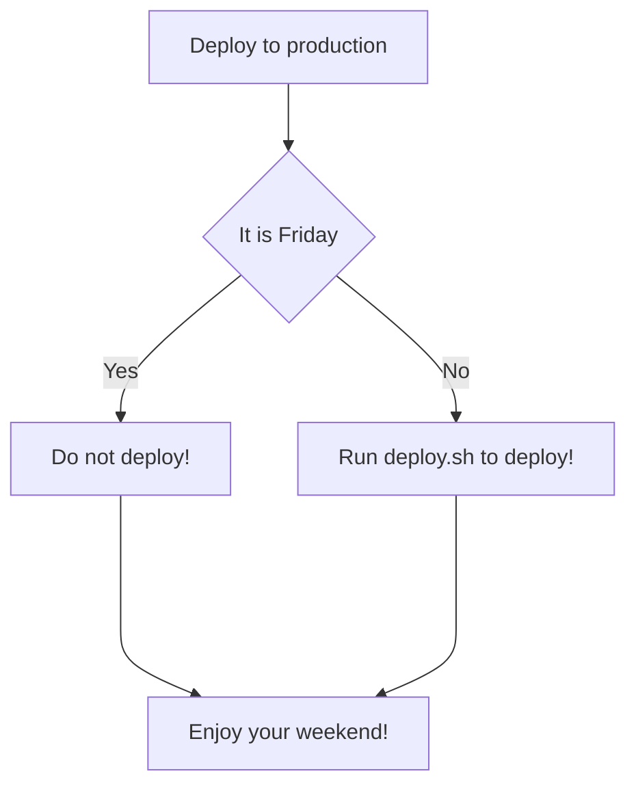

```mermaid
graph LR
   A --> B
   A -->C
   C -->D
``` 

```mermaid
pie title Pets adopted by volunteers
  "Dogs" : 386
  "Cats" : 85
  "Rats" : 35
```

```mermaid
flowchart TD
A[Deploy to production] --> B{It is Friday};
B -- Yes --> C[Do not deploy!];
B -- No --> D[Run deploy.sh to deploy!];
C ----> E[Enjoy your weekend!];
D ----> E[Enjoy your weekend!];
```
