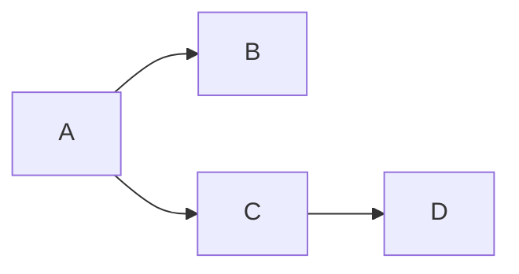
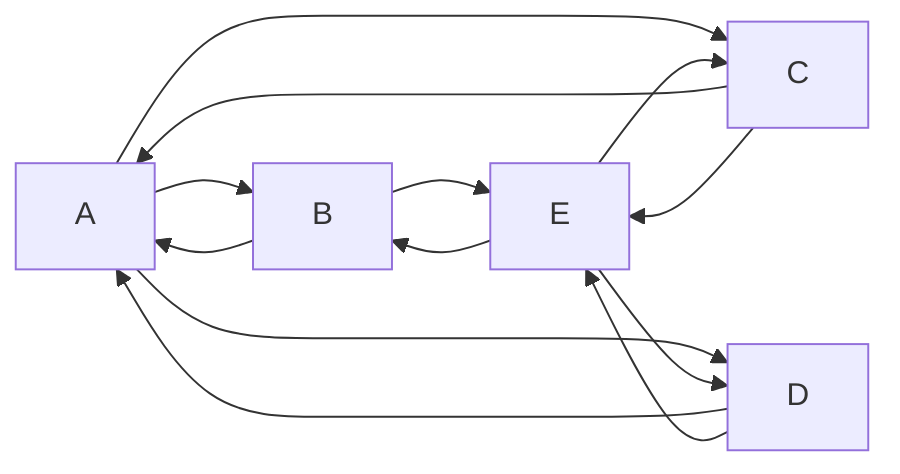
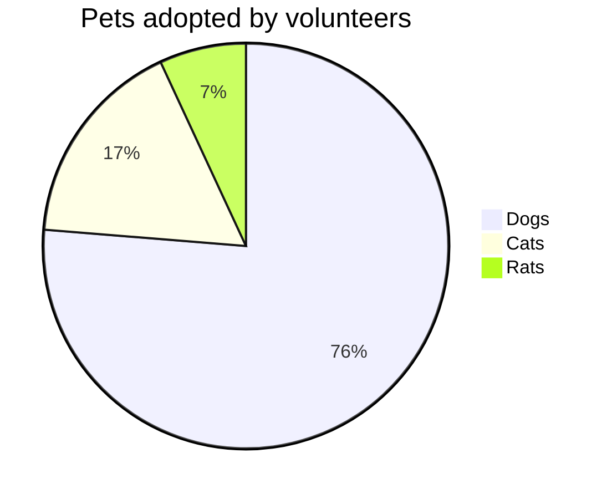
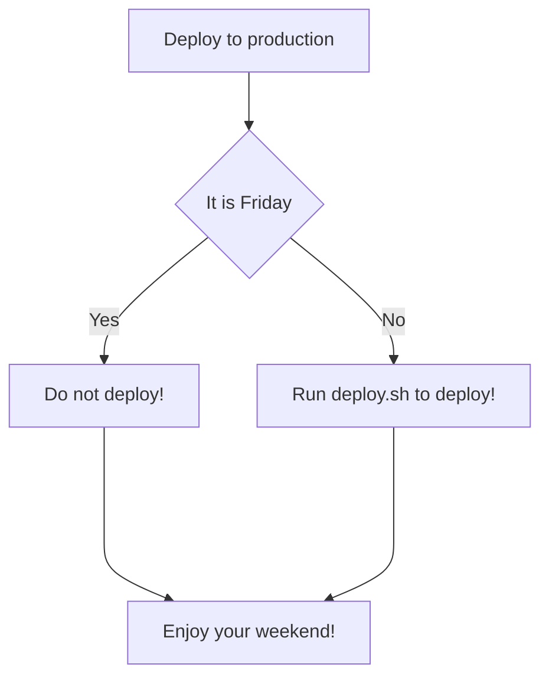
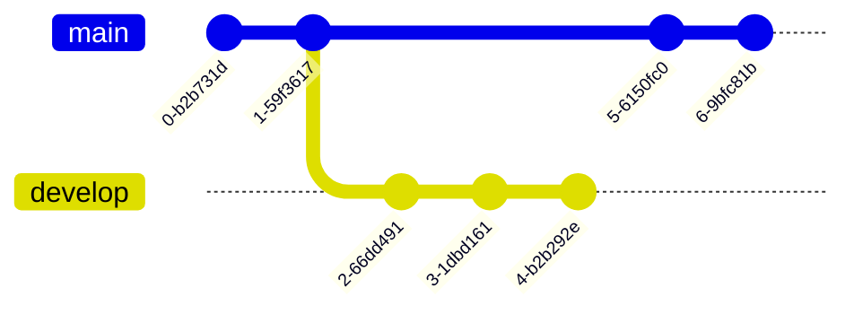
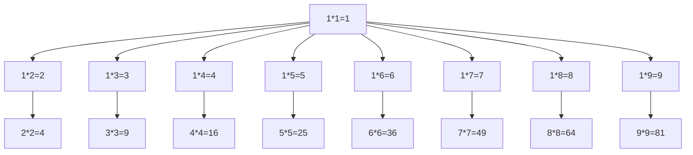
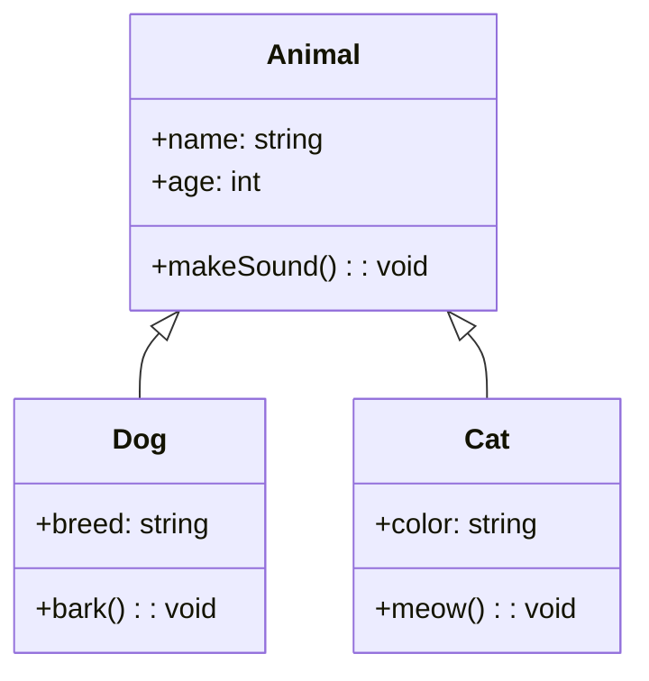
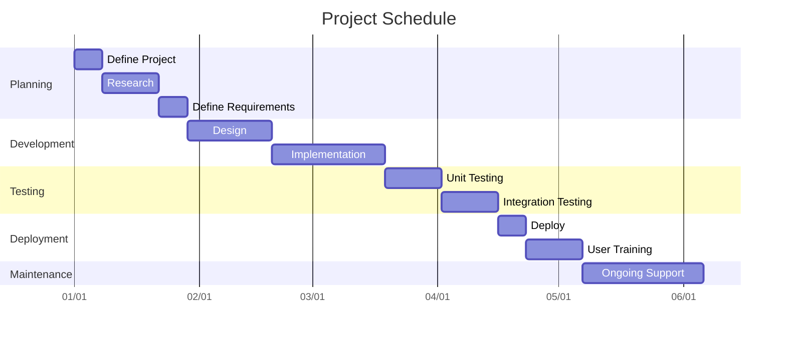
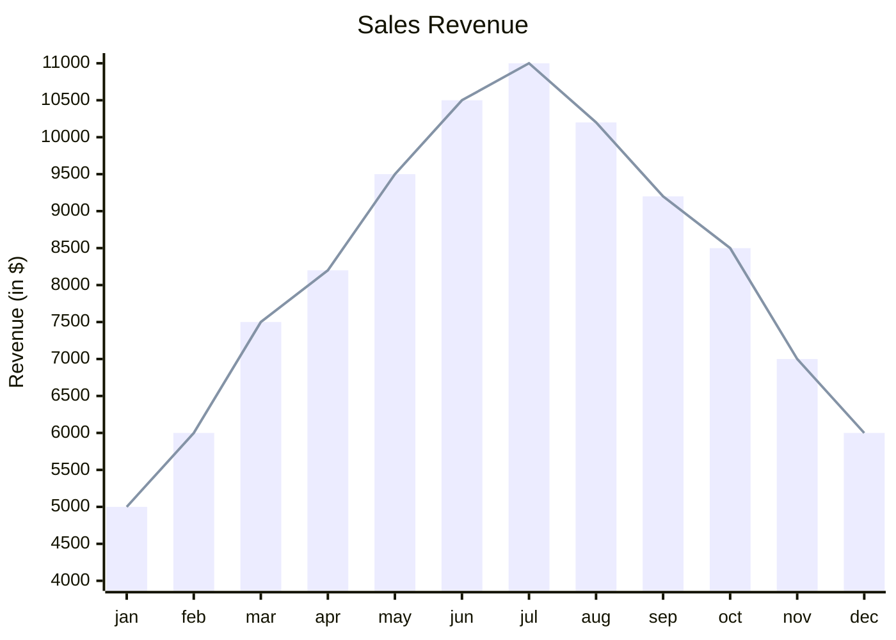

#### Mermain

- [Mermaid: Generate diagrams from markdown-like text.](https://github.com/mermaid-js/mermaid/blob/develop/README.md)
- [Mermaidv10.5.0 Live Editor](https://mermaid.live/)
- [A Mermaid User-Guide for Beginners](https://mermaid.js.org/intro/getting-started.html)
- [How to Create Diagrams as Code with Mermaid, GitHub, and Visual Studio Code (SEPTEMBER 6, 2023)](https://www.freecodecamp.org/news/diagrams-as-code-with-mermaid-github-and-vs-code/)

