## Mermain

- [Mermaid: Generate diagrams from markdown-like text.](https://github.com/mermaid-js/mermaid/blob/develop/README.md)
- [Mermaidv10.5.0 Live Editor](https://mermaid.live/)
- [A Mermaid User-Guide for Beginners](https://mermaid.js.org/intro/getting-started.html)
- [How to Create Diagrams as Code with Mermaid, GitHub, and Visual Studio Code (SEPTEMBER 6, 2023)](https://www.freecodecamp.org/news/diagrams-as-code-with-mermaid-github-and-vs-code/)

#### [Flowcharts - Basic Syntax](https://mermaid.js.org/syntax/flowchart.html)
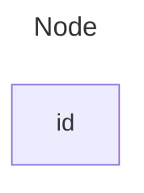

#### [A node with text](https://mermaid.js.org/syntax/flowchart.html)
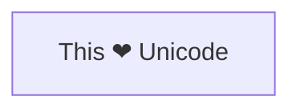

#### [Markdown formatting](https://mermaid.js.org/syntax/flowchart.html)
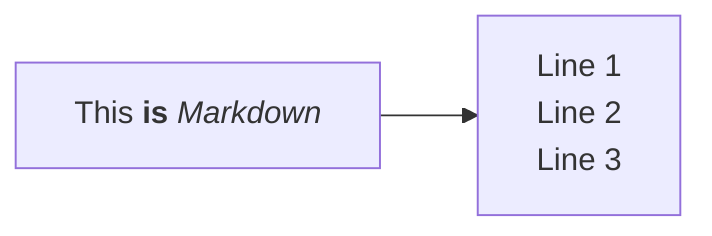

### [An invisible link](https://mermaid.js.org/syntax/flowchart.html#an-invisible-link)

LR vs. TD 隱藏的鏈結線 

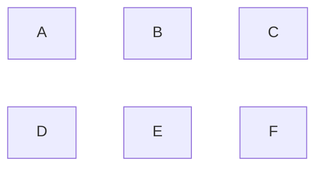

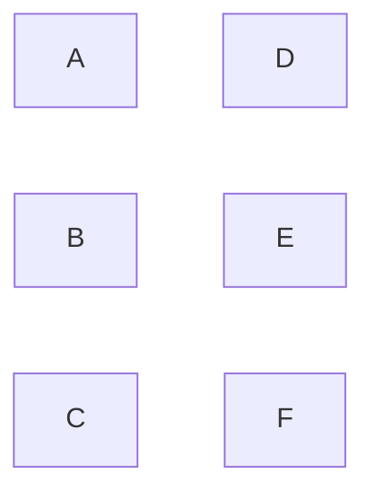

### [Chaining of links](https://mermaid.js.org/syntax/flowchart.html#chaining-of-links)
###
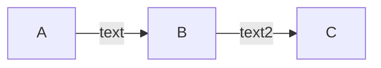
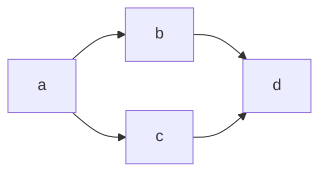

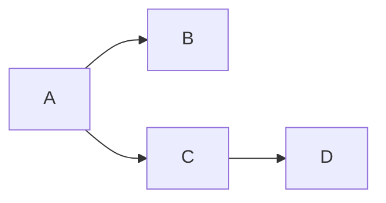

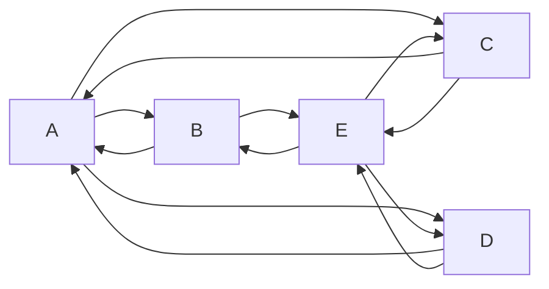

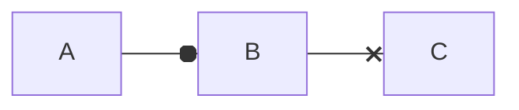

#### [State diagrams](https://mermaid.js.org/syntax/stateDiagram.html)
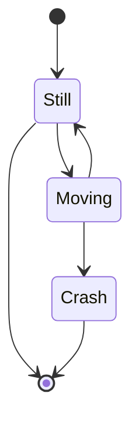

#### [Apply classDef styles to states](https://mermaid.js.org/syntax/stateDiagram.html#apply-classdef-styles-to-states)
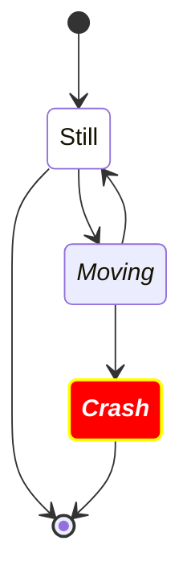

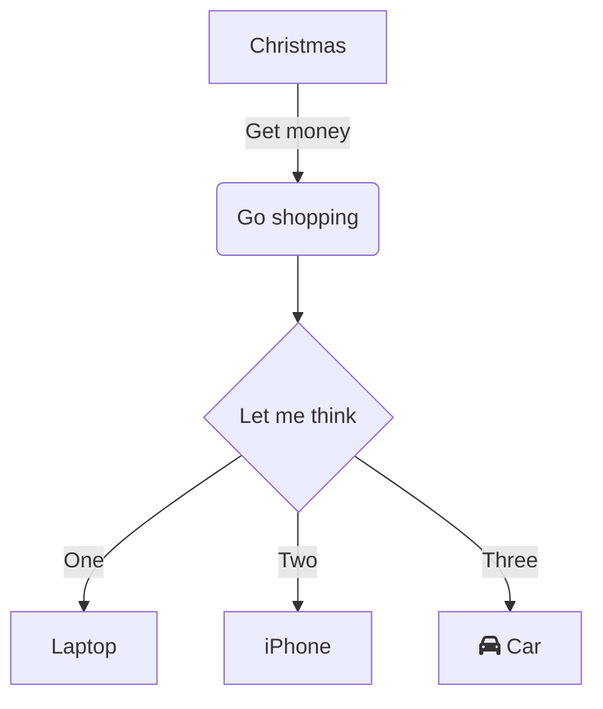

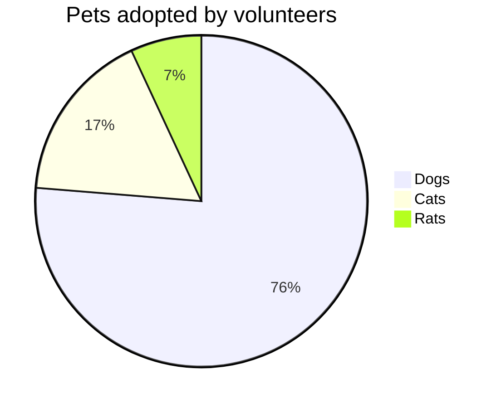

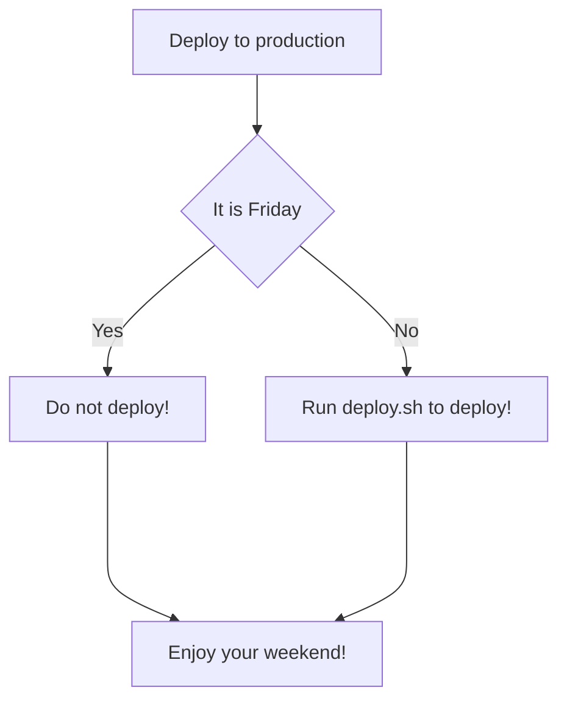


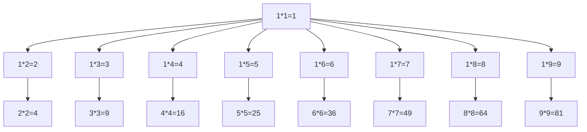

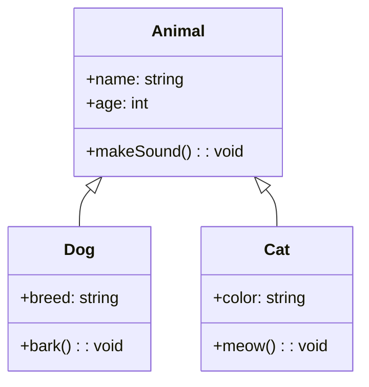

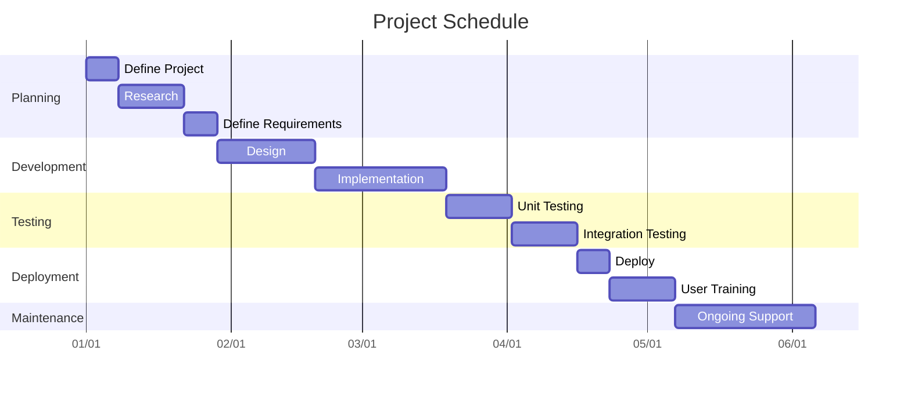


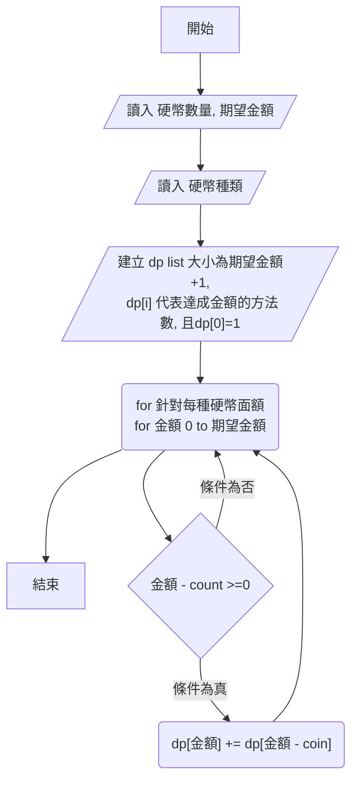

```mermaid

 graph TD
 id1[方框] -->
 id2(帶有圓角的方框) -->
 id3([體育場形狀]) -->
 id4[[子例程]] -->
 id5[(圓柱狀)]-->
 id6((圓形))
 id7>非對稱形狀] -->
 id8{菱形} -->
 id9{{六角形}}
 id10[/平行四邊形1/] -->
 id11[\平行四邊形2\] -->
 id12[/梯形1\] -->
 id13[\梯形2/]
```
