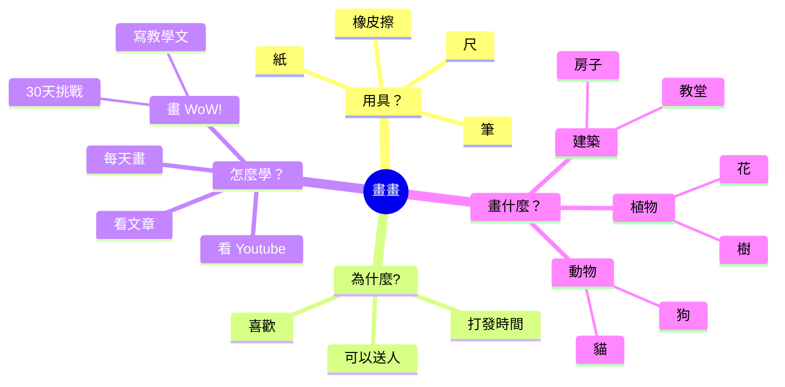

# 心智圖

```mermaid
mindmap
  root((畫畫))
    用具？
      紙
      筆
      尺
      橡皮擦
    為什麼?
      打發時間
      可以送人
      喜歡
    怎麼學？
      每天畫
      看 Youtube
      看文章
      畫 WoW!
        30天挑戰
        寫教學文
    畫什麼？
      建築
        房子
        教堂
      植物
        花
        樹
      動物
        貓
        狗
```
